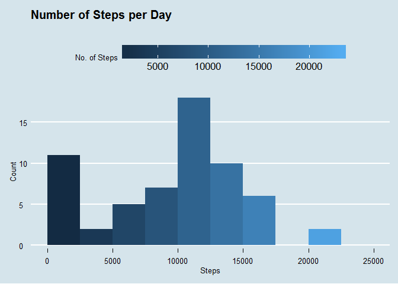
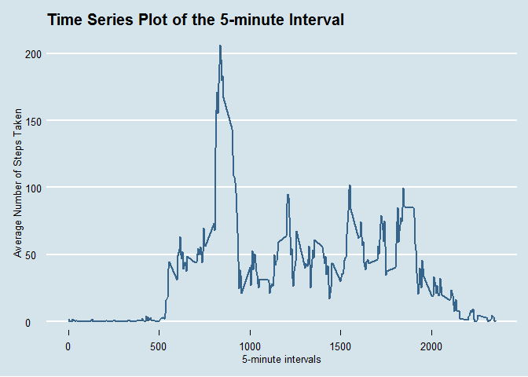
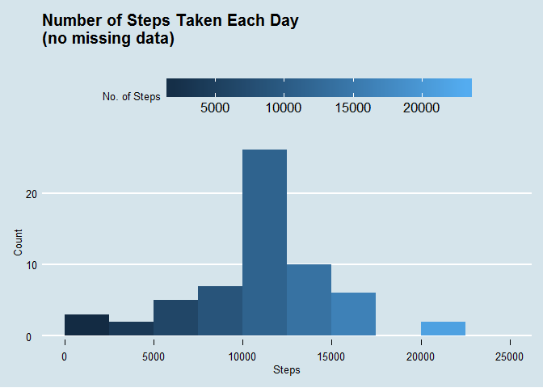
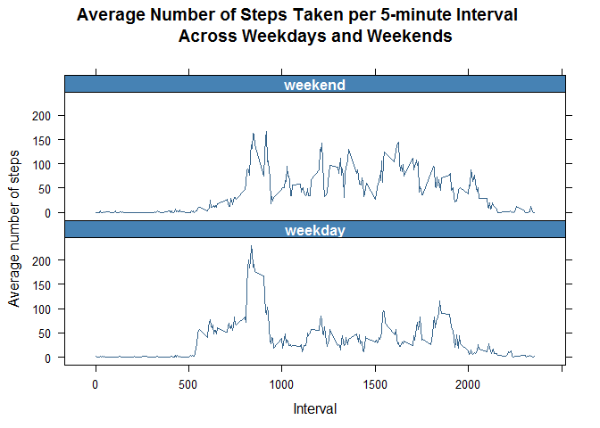

##Reproducible Research: Peer Graded Assignment: Course Project 1
<br>

###Assignment
This assignment makes use of data from a personal activity monitoring device. This device collects data at 5 minute intervals through out the day. The data consists of two months of data from an anonymous individual collected during the months of October and November, 2012 and include the number of steps taken in 5 minute intervals each day.
<br>

####Settings for visualizing code in the R markdown document and loading packages

```r
echo = TRUE  # Always make code visible
options(scipen = 1)  # Turn off scientific notations for numbers

library(ggplot2)  # Load package 'ggplot2'
library(ggthemes)  # Load package 'ggthemes' 
```

```
## Warning: package 'ggthemes' was built under R version 3.3.1
```

```r
library(lattice)  # Load package 'lattice'
```
<br>

### 1. Loading and processing the data
####Load the data

```r
# Download and unzip the data
if(!file.exists("getdata-projectfiles-UCI HAR Dataset.zip")) {
        temp <- tempfile()
        download.file("http://d396qusza40orc.cloudfront.net/repdata%2Fdata%2Factivity.zip",
                       temp)
        unzip(temp)
        unlink(temp)
}
# Load the data 
data <- read.csv("activity.csv", 
                 colClasses = c("integer", "Date", "factor"))
```
<br>

####Process the data

```r
data$month <- as.numeric(format(data$date, 
                                "%m"))
# Remove missing values and load data into data frame `naData`
naData<- na.omit(data)
rownames(naData) <- 1:nrow(naData)
```
<br>

### 2. What is the mean total number of steps taken per day?

```r
# Calculate the total number of steps taken per day
steps <- with(data, tapply(steps, date, sum, na.rm=TRUE))
stepsPerDay <- data.frame(day=unique(data$date), steps=steps)

# Create a histogram of the total number of steps taken each day
ggplot(stepsPerDay, aes(x=steps)) + 
        geom_histogram(breaks=seq(0, 25000, by = 2500), 
                       aes(fill = ..x..)) + 
        scale_fill_gradient("No. of Steps") +
        labs(title="Number of Steps per Day") +
        labs(x="Steps", 
             y="Count") +
        theme_economist() + 
        scale_color_economist() +
        theme(legend.key.width=unit(2,"cm"))
```

<!-- -->
<br>
<br>

####Calculate and report the mean and median of the total number of steps taken per day

```r
mean <- mean(stepsPerDay$steps, na.rm=TRUE) # Calculate mean value of steps per day
median <- median(stepsPerDay$steps, na.rm=TRUE) # Calculate median value of steps per day
mean 
```

```
## [1] 9354.23
```

```r
median
```

```
## [1] 10395
```
The `mean` value of steps per day is 9345 and the `median` value 10395.
<br>
<br>

### 3. What is the average daily activity pattern?
####Create a time series plot of the 5-minute interval (x-axis) and the average number of steps taken, averaged across all days (y-axis)

```r
# Calculate average steps for each interval for all days
avgSteps <- aggregate(naData$steps, 
                      list(interval = as.numeric(as.character(naData$interval))), 
                      FUN = "mean")
names(avgSteps)[2] <- "meanOfSteps"

# Plot the Average Number Steps per Day by Interval
ggplot(avgSteps, aes(interval, meanOfSteps)) + 
        geom_line(color = "steelblue4", 
                  size = 0.8) + 
        labs(title = "Time Series Plot of the 5-minute Interval", 
             x = "5-minute intervals", 
             y = "Average Number of Steps Taken") +
        theme_economist() + 
        scale_color_economist()
```

<!-- -->
<br>
<br>

####Find the 5-minute interval, on average across all the days in the dataset, contains the maximum number of steps?

```r
avgSteps[avgSteps$meanOfSteps == max(avgSteps$meanOfSteps), ]
```

```
##     interval meanOfSteps
## 104      835    206.1698
```
The 5-minute interval that, on average, contains the maximum number of steps is 835.
<br>
<br>

### 4. Imputing missing values
####Calculate the total number of missing values in the dataset 

```r
sum(is.na(data))
```

```
## [1] 2304
```
The total number of missing values in the dataset is 2304.
<br>

####Missing values were imputed by inserting the average for that 5-minute interval to fill each missing value in the steps column. 

```r
# Create a new dataset that is equal to the original dataset but with the missing data filled in and load new data into data frame `imputedData`
imputedData <- data 
for (i in 1:nrow(imputedData)) {
    if (is.na(imputedData$steps[i])) {
        imputedData$steps[i] <- avgSteps[which(imputedData$interval[i] == avgSteps$interval),
                                         ]$meanOfSteps
    }
}
```
<br>

####Create a histogram of the total number of steps taken each day after missing values are imputed 

```r
# Calculate the new total number of steps taken per day
newStepsPerDay <- aggregate(steps ~ date, imputedData, sum)

# Create a histogram of the new total number of steps taken each day
ggplot(newStepsPerDay, aes(x=steps)) + 
        geom_histogram(breaks=seq(0, 25000, by = 2500), 
                       aes(fill = ..x..)) + 
        scale_fill_gradient("No. of Steps") + 
        labs(title="Number of Steps Taken Each Day \n(no missing data)") +
        labs(x="Steps", 
             y="Count") +
        theme_economist() + 
        scale_color_economist() +
        theme(legend.key.width=unit(2,"cm"))
```

<!-- -->
<br>
<br>

####Calculate the new mean and new median of total number of steps taken per day

```r
newTotalSteps <- aggregate(imputedData$steps, 
                           list(Date = imputedData$date), 
                           FUN = "sum")$x
newMean <- mean(newTotalSteps)
newMean
```

```
## [1] 10766.19
```

```r
newMedian <- median(newTotalSteps)
newMedian
```

```
## [1] 10766.19
```
The `mean` and `median` values of steps taken per day are equal to 10766. These values differ greatly from the estimates from the first part of the assignemnt because replacing `NA` with mean values of steps creates more data and hence we have bigger mean and median values.
<br>
<br>

####Do these values differ from the estimates from the first part of the assignment?

```r
oldMean <- mean(stepsPerDay$steps, na.rm=TRUE) 
oldMedian <- median(stepsPerDay$steps, na.rm=TRUE) 
newMean - oldMean
```

```
## [1] 1411.959
```

```r
newMedian - oldMedian
```

```
## [1] 371.1887
```
After imputing the missing data, these values differ significantly from the estimates from the first part of the assignment. The new mean comprises of 1412 more steps taken per day and the new median of 371 steps more than before replacing the missing data.
<br>
<br>

### 5. Are there differences in activity patterns between weekdays and weekends?
#### Create a new factor variable in the dataset with two levels - "weekday" and "weekend" indicating whether a given date is a weekday or weekend day.

```r
imputedData$weekdays <- factor(format(imputedData$date, 
                                      "%A"))
levels(imputedData$weekdays)
```

```
## [1] "Friday"    "Monday"    "Saturday"  "Sunday"    "Thursday"  "Tuesday"  
## [7] "Wednesday"
```

```r
levels(imputedData$weekdays) <- list(weekday = c("Monday", 
                                                 "Tuesday",
                                                 "Wednesday", 
                                                 "Thursday", 
                                                 "Friday"),
                                     weekend = c("Saturday", 
                                                 "Sunday"))
avgSteps <- aggregate(imputedData$steps, 
                      list(interval = as.numeric(as.character(imputedData$interval)), 
                           weekdays = imputedData$weekdays),
                      FUN = "mean")
names(avgSteps)[3] <- "meanOfSteps"
```
<br>

#### Create a panel plot comparing the average number of steps taken per 5-minute interval across weekdays and weekends

```r
my.settings <- list(
        plot.line=list(col= "steelblue4",
                       border="transparent"),
        strip.background=list(col= "steelblue"),
        strip.border=list(col="black")
        )

xyplot(avgSteps$meanOfSteps ~ avgSteps$interval | avgSteps$weekdays, 
       layout = c(1, 2), 
       type = "l", 
       main="Average Number of Steps Taken per 5-minute Interval 
       Across Weekdays and Weekends", 
       xlab = "Interval", 
       ylab = "Average number of steps",
       scales=list(alternating=1), 
       par.strip.text=list(col="white", 
                           font=2),
       par.settings = my.settings)
```

<!-- -->

